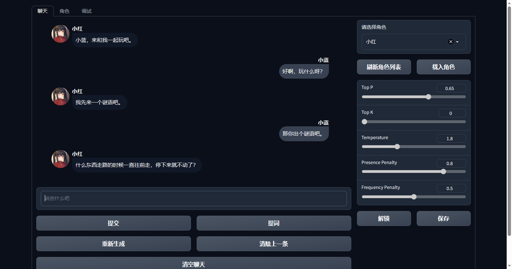
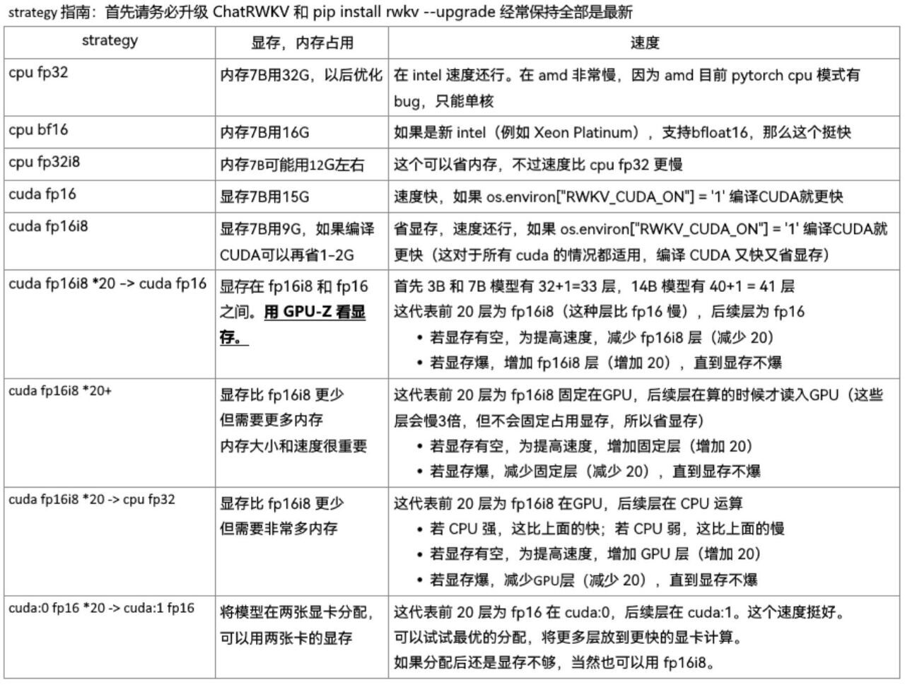
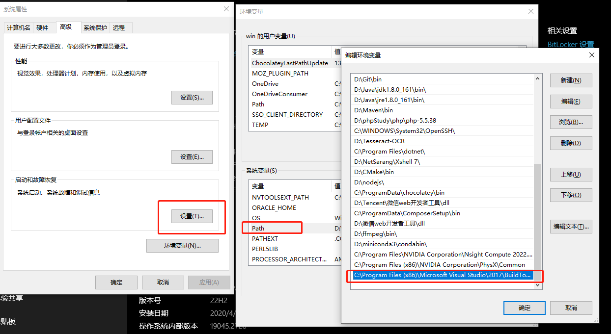

没有显卡？显存不足？内存不足？环境不会配置？现在都不用怕了，直接白嫖Google Colab吧！

## [点击这里快速到达](https://colab.research.google.com/drive/19cKRLE6WBVoVK1cHPNuc3KvmeQ9TO19G#scrollTo=t4daxu3L1Rbi)

如果需要给角色加头像的话，可以把头像命名为"角色名.png"放在char目录下，至于头像去哪儿找嘛……用sd生成一个就好了。

该项目虽然是个webui，但是不适合多人同时使用，如果需要多用户的话，可以参考这个项目

https://github.com/shengxia/RWKV_Role_Playing_API

## 一个基于RWKV的角色扮演玩具



就是这么一个玩意儿，连抄带编的弄出来了一个玩具，所以代码质量吗……请各位不要吐槽太多，但是也算是能玩吧。

另外，如果不知道人物性格怎么设定的话，我建议你可以下载一个Glow，这是[官网地址](https://glowapp.vip/)，然后到上面去找智能体，直接把它们的性格粘过来用是完全没问题的。

还玩个屁的Glow，RWKV-4-World-CHNtuned-3B-v1-20230625-ctx4096这个模型效果好的出奇，3B的参数量就能扮演一个不错的赛博小女友，玩了几天我都要喝营养快线了，现在7B的也出来了（RWKV-4-World-CHNtuned-7B-v1-20230709-ctx4096），效果确实强，话说啥时候有14B啊，给我一波升级显卡的动力。

目前我不再支持Raven系列的模型，而是改用World系列的模型了，这个模型在角色扮演上好太多了，我强烈推荐CHNtuned的模型，另外我在FAQ中也推荐了一些其他的模型，他们同样也非常适合角色扮演，如果你使用的是老版本的话，可能还需要更新一下RWKV库

```
pip install rwkv --upgrade
```

我增加了一个cfg参数（我没有研究过sd那边的cfg是怎么实现的，所以不确定这两者有没有什么区别），用户可以调整此参数来决定是否开启classifier-free guidance功能，0为不开启，我增加这个参数，主要是这么想的：我感觉随着聊天长度的增加，模型会忘记角色设定，我启用cfg的话，把角色的初始状态加入到cfg算法中，然后对原生成的内容进行干涉，我觉得这样应该可以从一定程度上来改善模型遗忘设定的问题。当然，这都是我的感觉，具体行不行还得测试，使用cfg这个参数，会增加文字生成的时长（大概是增加一倍的时长），总之目前这还是一个测试功能，如果没啥卵用我就给删了。

最近的更新中我又把角色的初始状态保存在了`chars/init_state/`下面，在切换模型后，除了要删除save文件夹下的.sav文件，记得也把这里的.sav文件删除一下，不然会报错。

之前的更新中加入了一个最小回复长度的参数，可以用这个方法让AI回复的更长（但是有可能输出很多无用的废话）。同时增加了替AI说的功能，当始终得不到符合心意的回复时，可以帮AI说一句，这样更有利于让剧情按照你的意思发展。

可以尝试给AI加入示例对话，示例对话可以更好的塑造AI的性格，旁白中加入更多的描写，相对应的，AI生成的旁白中也会有更多的细节描写，我给出的示例只是一个格式的示例，你完全可以发挥你的文采让对话更加丰富，不过请务必保证示例对话的格式是正确的。

在创建角色的时候，开场白以及示例对话中，旁白的识别方式可以在人物设定中指定，另外，旁白建议使用第三人称，使用第三人称能够更好地控制AI来对话（比如你感觉AI不一定会按你的要求做某件事，你就可以在你的旁白里面写阿珍看到了阿强开始做什么什么的）。

我个人比较喜欢让人物在回复时带上动作，所以目前我在代码里面做了一些隐式的定义，当在角色设定中指定了“旁白开始符号”和“旁白结束符号”，且在示例对话中包含这两个符号时，角色的回复每次都会尝试输出动作描写。

### 安装方法：

先安装依赖
```
pip install torch==1.13.1 --extra-index-url https://download.pytorch.org/whl/cu117 --upgrade

pip install -r requirements.txt
```

启动：
```
python webui.py --listen --model model/path
```

以下是一个例子: 
```
python webui.py --listen --model model/RWKV-4-World-CHNtuned-3B-v1-20230625-ctx4096
```
各种启动参数解释如下：

| 参数 | 解释 |
| --- | --- |
| --port | webui的端口 |
| --model | 要加载的模型路径 |
| --strategy | 模型加载的策略 |
| --listen | 加上这个参数就允许其他机器访问 |
| --cuda_on | 控制RWKV_CUDA_ON这个环境变量的，0-禁用，1-启用 |
| --jit_on | 控制RWKV_JIT_ON这个环境变量的，0-禁用，1-启用 |
| --share | 生成gradio链接 |
| --lang | 语言，zh-中文，en-英文 |

模型的加载方式（--strategy）我默认使用的是"cuda fp16i8"，如果想使用其他的加载方式可以自行调整该参数，具体有哪些值可以参考[这个文章](https://zhuanlan.zhihu.com/p/609154637)或者这张图

## FAQ

### 1. 能让AI生成文字的速度再快一点吗？

当然可以，在启动命令中加入--cuda_on 1，例子：
```
python webui.py --listen --model model/RWKV-4-World-CHNtuned-7B-v1-20230709-ctx4096 --cuda_on 1
```
但是你的机器必须安装Visual C++生成工具，以及Nvidia的CUDA，CUDA比较好解决（可能还得装CUDNN，我没验证到底要不要，反正我是都装了），去官网下载就行了，建议安装11.7版本，这个Visual C++生成工具可以参考[这个链接](https://learn.microsoft.com/zh-cn/training/modules/rust-set-up-environment/3-install-build-tools)装好之后还需要配置一下环境变量，如下图：

我这里配置的值是C:\Program Files (x86)\Microsoft Visual Studio\2017\BuildTools\VC\Tools\MSVC\14.16.27023\bin\Hostx64\x64，你们根据实际情况进行配置，主要是找到cl.exe这个文件所在的文件夹，当然也要注意架构，不过一般来说，大家都是64位的系统了吧。这样就算是完成了，然后在运行脚本，你会发现文字的生成速度提高了很多。

### 2. 我在哪里可以下载的到模型呢？

当然是在[这里](https://huggingface.co/BlinkDL)，请使用RWKV-4-world系列CHNtuned模型，另外，如果使用参数量在1.5B及以下这样的模型，需要把策略改为cuda fp32或cpu fp32，否则会溢出。

另外，我也很推荐这个模型 https://huggingface.co/xiaol/RWKV-claude-4-World-7B-65k 
这个模型是使用shareClaude进行微调的，且把上下文长度增加到了65k，玩起来效果很棒。

还有这个模型 https://huggingface.co/xiaol/rwkv-7B-world-novel-128k
这个模型使用了大量的小说进行微调，我发现这个模型对动作、场面等描写相当不错，而且最可贵的是，这个模型好像没啥善恶观，自由度挺高的，上下文长度为128k，也值得尝试一下。

### 3. top_p、temperature、presence、frequency这几个参数有什么设置技巧吗？

top_p值越低，答案越准确而真实。更高的值鼓励更多样化的输出；temperature值越低，结果就越确定，因为总是选择概率最高的下一个词/token，拉高该值，其他可能的token的概率就会变大，随机性就越大，输出越多样化、越具创造性。

根据我这段时间的把玩，感觉top_p最好设置在0.5以上，temperature可以设置在1.5以上。

这里给出一个我使用的配置：
```
{
  "top_p": 0.6,
  "temperature": 1.5,
  "presence": 0.2,
  "frequency": 0.2
}
```
模型尽量用新的、中文含量高的（我这里默认大家都用中文聊天）。

这里建议在刚开始对话的时候，使用上面的那个配置，当对话进行到一定程度之后（大概六七轮左右），把配置改成下面的：
```
{
  "top_p": 0.75,
  "temperature": 2.5,
  "presence": 0.2,
  "frequency": 0.2
}
```
另外，在开启“用User和Assistant代替你和角色的名字”这个选项后，会发现随着对话轮次的增加，角色的回复前几个字会变得一样，所以可以这样配置：
```
{
  "top_p": 0.75,
  "temperature": 2.5,
  "presence": 0,
  "frequency": 1
}
```
还有，也可以试试top=0.7，temperature=0.1这种配置，我感觉这个效果也不错。

另外，我最近加入了一种新的采样方式，当tau这个参数不为0的时候，则启用该方法，该采样方式下，top_p参数将会失效，其他的参数依然可以使用，反正感觉效果也挺微妙的，可以尝试尝试。

### 4. 模型会在输出回答后，又输出一大堆乱七八糟的内容。

我增加了一个调试页面，可以查看当前的token内容，一般输出乱七八糟的内容都是对话格式有误，正确的对话格式是这样的：
```
用户名: xxxxxxxxx

角色名: xxxxxxxx

用户名: xxxxxxxxxxxxxxx

```
其中冒号是英文冒号且冒号后面有一个空格，每句对话后面都有两个换行（\n\n）。

### 5. 为什么你的colab里要用fp16i8的7B模型？

没办法啊，免费的colab就给12G的内存，我用原版的7B模型，加载需要内存14G，colab它加载不进去啊！

### 6. 为什么不用流式输出？

在dev分支的某个版本中我尝试着使用了流式输出，虽然效果还不错，但是在对话久了之后，速度明显慢了，主要是传回的html代码大了，一句话十个字就得传10次，拖慢了速度，也有点耗费流量，感觉得不偿失（你说在本地用不怕耗流量？但是我喜欢用手机随时随地玩）当然，也可能是我的水平没到，写不出来增量传输。

### 7. 为什么清除上一条对话然后再生成对话时，需要这么长的时间？

因为我不会用gradio清除多条对话，所以只能让用户一条一条的清除，但是以前的方法，每清除一条就要重新计算一次状态的确有点儿浪费，于是我改了一下逻辑，你可以随意清除上一条，我这边只记录下来你清除了多少，当你再次对话的时候，我就一次性的把状态回退到你清除的那个地方，这样在清除多条的时候就比较省时（当然了，这个重新计算状态所耗的时间实在是没办法，除非你勤存档）。

### 8. 界面有英文了，为啥README没有英文？

别太难为我了，你要看了我那个英文的语言文件就知道我英文水平啥样了，出个英文的README有点儿太难为我了。

### 9. 还有其他想说的吗？

这次更换为world系列模型之后，虽然回复的水平上去了，但是感觉还是带着AI的味儿，我在角色选项卡中增加了一个选项，可以使用User和Assistant来代替你和角色的名称，使用该选项生成的格式如下：
```
User: xxxxxxxxx

Assistant: xxxxxxxx

User: xxxxxxxxxxxxxxx

```
不使用该选项生成的格式如下：
```
用户名: xxxxxxxxx

角色名: xxxxxxxx

用户名: xxxxxxxxxxxxxxx

```
随着模型的更新，目前7B的world-CHNtuned系列模型就算使用User和Assistant的感觉已经好了很多，而且对话生成的效果比使用“用户名和角色名”要好（配合最小生成长度这个参数，可以弄出claude的感觉），但是也会有一些思想钢印的存在（比如AI会很拒绝做坏事，就算做了也是不情不愿的，但是使用“用户名和角色名”时就不会这样）。总之可以根据各位的喜好来修改。

**不过需要注意的是，在修改完角色选项卡中的任何项目并点击保存后，程序会清空当前的对话（不清空没办法让修改后的设置生效），所以进行此操作务必谨慎。**